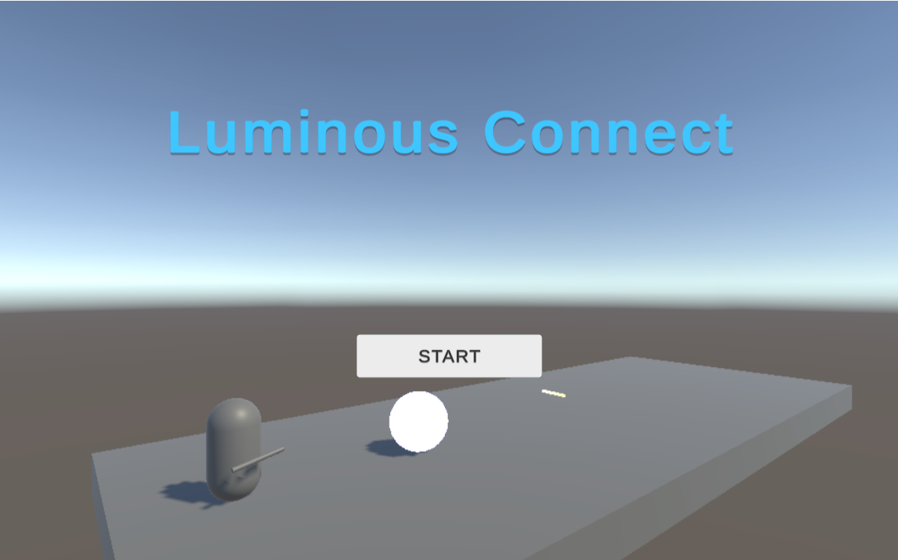
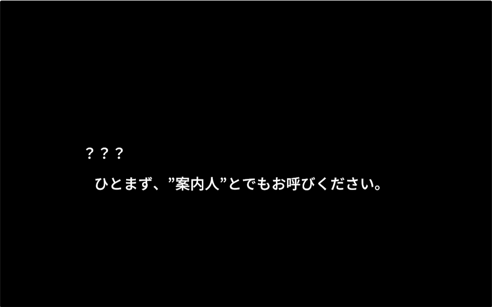

# LuminousConnect

## プログラムの場所
* Assets/Scriptsフォルダ・・・各スクリプト

## 作品の概要

### 作品について
光を失いゆく「ルミナスボール」を、輝きが消える前にゴールへと導く3Dゴルフアクションゲームです。  
単なるアクションに留まらず、UIによる情報の可視化や、プレイヤーを導く案内人との会話システムなど、ユーザーエクスペリエンス（UX）を意識した作品作りを目指しました。

[サンプルゲームをプレイ](https://limit-sy.github.io/luminousconnect_gameplay/)

### 作品の遊び方
案内人との会話からゲームがスタートします。  
広大なフィールドでボールを打ち出し、規定打数（PAR）内でのゴールを目指してください。  
ボールを打つたびに輝きが弱まっていくため、効率的なルート選びが重要です。  


**基本操作**
* 移動：方向キー / 左スティック
* カメラ移動：WASDキー / 右スティック
* エイムモード（狙う）：Xキー / R1ボタン
* ショット：Cキー / □ボタン

## 仕様技術・ツール
* Unity (6000.3.5f2)
* Visual Studio Community 2026 C#
* Cinemachine (カメラ制御)
* Unity Input System
* TextMeshPro

## 制作期間
* 2026年3月31日 ～ 2026年4月20日

## 制作のポイント
### 独自会話システムの構築と演出へのこだわり
本作の核となる案内人との会話シーンは、既存のシステムを使わず、スクリプトからUIレイアウトまでを一から独自に構築しました。  
単にテキストを表示するだけでなく、プレイヤーがストレスなく読み進められるよう、1画面の文字数を「22文字×2行」に制限。さらに、往年の名作アドベンチャーゲームを彷彿とさせる「独特の間」や「タメ」を意識した文章構成を行い、チュートリアルを「読まされるもの」から「次の展開が気になる演出」へと昇華させました。

### CinemachineとInput Systemの高度な連携
3D空間での快適な操作性を実現するため、CinemachineのFreeLookカメラをカスタマイズしました。  
特定の入力軸のみを有効化し、マウス操作に頼らない「キーボードとゲームパッドに特化した視点操作」をInput Systemで構築しています。また、エイム時には打点を狙いやすいようカメラアングルを固定する仕組みを取り入れています。

### 状況に応じた動的なUI制御
プレイの邪魔にならないよう、案内人との会話中には操作説明などのHUDを自動で非表示にする機能を実装しました。  
`CanvasGroup` を活用し、スクリプトの実行状態を維持したまま、透明度（Alpha）のみを制御することで、スムーズなUIの切り替えを実現しています。

```C#
// UIController.csより抜粋

// 会話状況に応じてUIの表示・非表示を切り替える
void Update()
{
    // DialogueManagerの会話フラグを監視
    if (DialogueManager.IsTalking)
    {
        // 会話中は透明度を0にして非表示にする
        canvasGroup.alpha = 0f;
        canvasGroup.blocksRaycasts = false;
    }
    else
    {
        // 探索・操作中は再表示
        canvasGroup.alpha = 1f;
        canvasGroup.blocksRaycasts = true;
    }
}
```

### ドラマチックなテキスト演出と会話システム
ユーザーへのチュートリアルを退屈させないよう、往年のアドベンチャーゲームのような「1画面の文字数制限」や「独特のリズム」を意識した会話システムを導入しました。  
メッセージウィンドウのレイアウトを最適化し、プレイヤーの没入感を高める工夫を凝らしています。

### 課題
前作では書籍の構成に頼っていた部分がありましたが、今作では「なぜその設計にするのか」を自問自答しながら、自分なりのクラス設計（UIの管理、カメラの制御など）を盛り込むことができました。  
一方で、ステージが広大になるにつれて、オブジェクトの管理やパフォーマンスの最適化について、より深く学ぶ必要があると感じています。

### 今回のゲームをもっと面白くする課題
* ステージのギミック（動く床、風、ワープなど）の追加
* ボールの「輝き」の変化による視覚的な演出の強化
* ハイスコア（最小打数）のオンラインランキング機能

### 所感
今作で最も力を入れたのは、ゼロからの会話システムの構築と、そこでの「言葉選び」です。  
3Dアクションとしての手触りを追求するのはもちろん、案内人というキャラクターを通じてプレイヤーを導くための「読みやすさ」や「物語の引き」を自力で実装できたことは、大きな自信に繋がりました。  
技術的な実装力と、プレイヤーを楽しませる演出力の両面を意識できた「LuminousConnect」の開発経験を糧に、次作ではさらに洗練されたクラス設計と没入感のあるゲーム体験の両立を目指します。